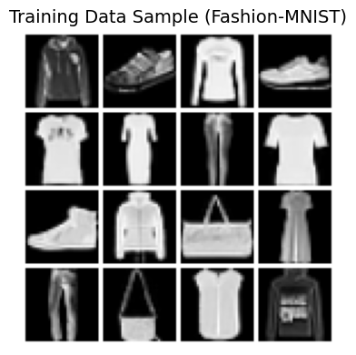
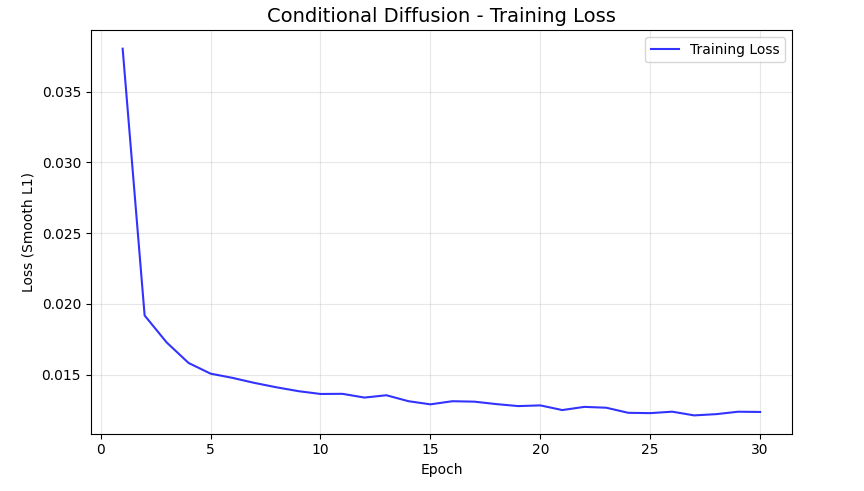
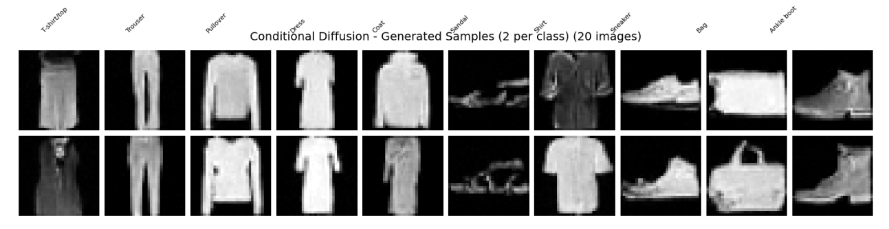
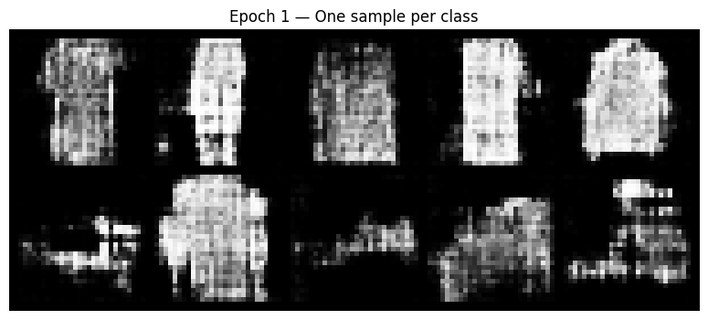
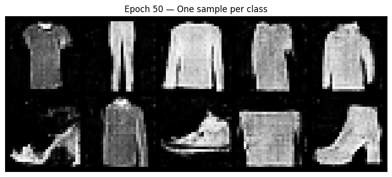

# Conditional Image Synthesis: Benchmarking Adversarial vs. Diffusion Approaches

A comparative study of **conditional image generation** on Fashion-MNIST using two paradigms: **Conditional GANs** (adversarial) and **Conditional Diffusion Models** (denoising). Both approaches generate class-conditioned fashion item images (T-shirts, trousers, dresses, etc.) from label prompts.



*Fashion-MNIST training data sample (10 classes: T-shirt/top, Trouser, Pullover, Dress, Coat, Sandal, Shirt, Sneaker, Bag, Ankle boot)*

---

## Table of Contents

- [Overview](#overview)
- [Notebooks](#notebooks)
- [Approach Comparison](#approach-comparison)
- [Installation](#installation)
- [Usage](#usage)
- [Results](#results)
- [Project Structure](#project-structure)

---

## Overview

This project implements and benchmarks two state-of-the-art conditional image synthesis methods:

| Approach | Notebook | Key Idea |
|----------|----------|----------|
| **Conditional GAN** | `ConditionalGanStabilization.ipynb` | Generator–Discriminator adversarial training with stabilization techniques |
| **Conditional Diffusion** | `ConditionalDiffusion.ipynb` | DDPM-style denoising with U-Net and class conditioning |

Both models use **Fashion-MNIST** (28×28 grayscale, 10 classes) for efficient experimentation and comparison.

---

## Notebooks

### 1. Conditional Diffusion (`ConditionalDiffusion.ipynb`)

Implements a **DDPM-style conditional diffusion model** for Fashion-MNIST:

- **SimpleDiffusion**: β schedule (1e-4 → 0.02), forward/reverse process, iterative sampling
- **U-Net backbone**: ResNet blocks, sinusoidal time embeddings, linear/self-attention
- **Class conditioning**: Label embedding added to time embeddings
- **Training**: Smooth L1 loss, gradient clipping (1.0) for stability
- **Visualization**: Loss history, generated samples, conditioning debug





### 2. Conditional GAN Stabilization (`ConditionalGanStabilization.ipynb`)

Implements a **conditional GAN** with systematic stabilization and tuning:

- **Architecture**: Generator (100-dim noise + labels → 28×28), Discriminator (image + labels → logits)
- **Stabilization techniques**:
  - **Label smoothing** (0.9/0.1 instead of 1/0)
  - **Learning rate tuning** (e.g., slower D, faster G)
  - **Gradient penalty** (WGAN-GP style)
  - **Instance noise** (optional)
- **Analysis**: G/D loss comparison, G/D balance ratio, sample diversity debug





### 3. Supporting Notebooks

- **`ConditionalGanBaseline.ipynb`**: Minimal cGAN baseline
- **`ConditionalGan.ipynb`**: Alternative cGAN implementation

---

## Approach Comparison

| Aspect | Conditional GAN | Conditional Diffusion |
|--------|----------------|------------------------|
| **Training** | Min-max game (G vs D) | Denoising objective (predict noise) |
| **Sampling** | Single forward pass | Iterative (1000 steps) |
| **Stability** | Mode collapse, vanishing gradients | Generally more stable |
| **Speed** | Fast inference | Slower inference |
| **Quality** | Can be sharp but brittle | Often smoother, more diverse |

---

## Installation

### Requirements

- Python 3.8+
- PyTorch 2.x (with CUDA for GPU)
- torchvision, matplotlib, numpy, tqdm, einops

### Setup

```bash
pip install torch torchvision
pip install matplotlib numpy tqdm einops
```

For Jupyter:

```bash
pip install jupyter ipywidgets
```

---

## Usage

1. **Clone or download** this repository.
2. **Open** `ConditionalDiffusion.ipynb` or `ConditionalGanStabilization.ipynb` in Jupyter.
3. **Run all cells** in order. Data will be downloaded automatically (`./data`).
4. **Training**: Default 10 epochs for diffusion; configurable for GAN experiments.
5. **Generation**: Use the provided functions to generate samples for given class labels.

### Example: Generate with Diffusion

```python
# After training
display_generated_samples(model, diffusion, title="Conditional Diffusion - Generated Samples")
```

### Example: Compare GAN Experiments

```python
compare_experiments(histories, labels)
display_experiment_samples(trainer, "Label Smoothing")
```

---

## Results

- **Diffusion**: Produces recognizable class-conditioned fashion items; training loss decreases smoothly with gradient clipping.
- **GAN**: Baseline can suffer from D dominance; label smoothing and gradient penalty improve balance and sample quality.
- **Conditioning**: Both models respect class labels; debug utilities verify same-noise/different-labels behavior.

---

## Project Structure

```
.
├── ConditionalDiffusion.ipynb      # DDPM-style conditional diffusion
├── ConditionalGanStabilization.ipynb # cDCGAN with stabilization techniques
├── ConditionalGanBaseline.ipynb   # Minimal cDCGAN baseline
├── assets/                        # Images for README
│   ├── training_data.png
│   ├── diffusion_loss.png
│   ├── diffusion_samples.png
│   ├── gan_baseline.png
│   └── gan_comparison.png
└── README.md
```

---

## References

- **DDPM**: Ho et al., "Denoising Diffusion Probabilistic Models" (NeurIPS 2020)
- **cGAN**: Mirza & Osindero, "Conditional Generative Adversarial Nets" (2014)
- **WGAN-GP**: Gulrajani et al., "Improved Training of Wasserstein GANs" (2017)
- **Fashion-MNIST**: Xiao et al., "Fashion-MNIST: a Novel Image Dataset for Benchmarking ML Algorithms" (2017)
