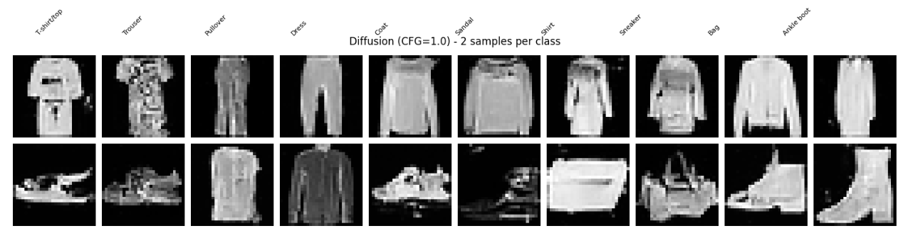
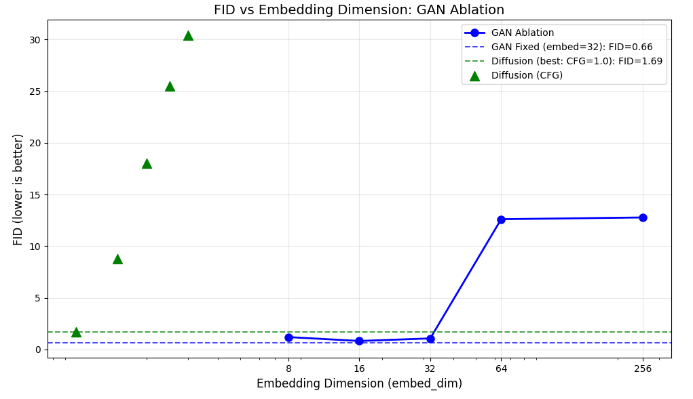
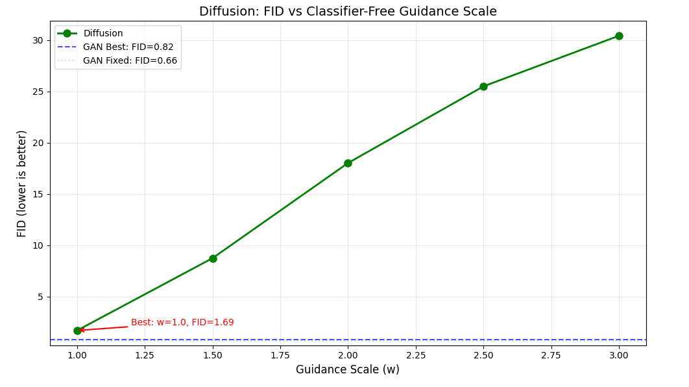
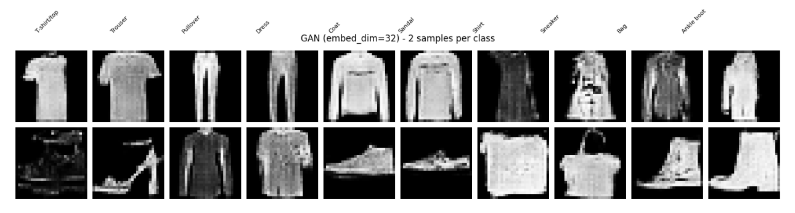
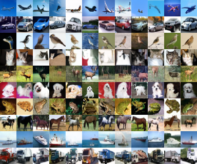

# Conditional Image Synthesis: Benchmarking Adversarial vs. Diffusion Approaches

A comparative study of conditional image generation with two paradigms: conditional GANs and conditional diffusion models. The main benchmark is on Fashion-MNIST, and the project also includes a qualitative CIFAR-10 adaptation of the diffusion pipeline.



---

## Table of Contents

- [Overview](#overview)
- [Notebooks](#notebooks)
- [Configurations](#configurations)
- [Results](#results)
- [Project Structure](#project-structure)
- [Installation](#installation)
- [Usage](#usage)
- [Code and Models](#code-and-models)
- [References](#references)

---

## Overview

This repository accompanies the report in `report/main.tex` and studies two complementary questions:

1. How label embedding size affects mode collapse in conditional GANs.
2. How classifier-free guidance behaves in diffusion models on a simple low-resolution dataset.

The report’s main conclusions are:

- The GAN ablation shows a clear U-shaped relationship between label embedding dimension and generation quality.
- The best GAN configuration on Fashion-MNIST outperforms the best tested diffusion configuration on FID, recall, and conditional accuracy.
- For this dataset, stronger classifier-free guidance degrades diffusion performance instead of improving it.
- The CIFAR-10 experiment shows that moving from grayscale `28x28` images to RGB `32x32` images requires a more expressive conditional U-Net and longer training.

---

## Notebooks

### 1. Baseline Conditional Diffusion (`ConditionalDiffusion.ipynb`)

Implements a conditional DDPM-style model for Fashion-MNIST with:

- a U-Net backbone
- sinusoidal timestep embeddings
- class conditioning through learned embeddings
- denoising training and iterative sampling

### 2. CIFAR-10 Conditional Diffusion (`cifar10diffusion.ipynb`)

Adapts the diffusion pipeline to CIFAR-10 using:

- RGB `32x32` inputs and outputs
- residual blocks with group normalization and SiLU
- self-attention at `16x16` and in the bottleneck
- cosine schedule, EMA, mixed precision, and classifier-free guidance training

### 3. Schema / Visualization Notebook (`ConditionalDiffusionSchemaOutputs.ipynb`)

Generates supporting visuals used for the architecture figure and report illustrations.

### 4. Report Notebooks

- `report/ConditionalDiffusion.ipynb`: report copy of the baseline Fashion-MNIST diffusion notebook
- `report/ConditionalDiffusionImproved.ipynb`: improved Fashion-MNIST diffusion implementation described in the report

---

## Configurations

### Conditional GAN

The report studies a DCGAN-style conditional GAN where:

- noise dimension is fixed at `256`
- label embedding dimension varies in `{8, 16, 32, 64, 256}`
- training uses Adam and gradient penalty
- the goal is to identify when class embeddings become so expressive that the generator ignores noise

### Diffusion on Fashion-MNIST

The improved diffusion setup includes:

- cosine noise schedule
- EMA of model weights
- classifier-free guidance with label dropout
- DDIM sampling
- a conditional U-Net with residual blocks and attention

### Diffusion on CIFAR-10

Compared with the Fashion-MNIST version, the CIFAR-10 model is adapted by:

- switching from grayscale to RGB
- using a clean `32 -> 16 -> 8 -> 4` spatial pyramid
- widening the denoiser with `base_channels=128` and channel multipliers `(1, 2, 2, 4)`
- using a more conservative long-run training recipe for a harder dataset

---

## Results

### GAN Ablation

The best fixed GAN configuration achieves:

- `FID = 0.66`
- `Recall = 0.915`
- `Conditional accuracy = 83.3%`

The key observation is that `embed_dim=16-32` works best, while larger embeddings trigger mode collapse.



### Diffusion on Fashion-MNIST

The best tested guidance scale is `w=1.0`, which achieves:

- `FID = 1.69`
- `Recall = 0.896`
- `Conditional accuracy = 72.6%`

Higher guidance values worsen FID and conditional accuracy on this dataset.



### Qualitative Comparison

The report shows that both models produce recognizable Fashion-MNIST outputs, but the GAN remains stronger quantitatively in this setting.



### CIFAR-10 Adaptation

The CIFAR-10 diffusion experiment is included as a qualitative transfer study. The final sample grid is cleaner and more class-consistent than early snapshots, but the outputs remain softer than Fashion-MNIST silhouettes because CIFAR-10 is more complex.



---

## Project Structure

```text
.
├── assets
├── data
├── models
├── schema_outputs
├── ConditionalDiffusion.ipynb
├── ConditionalDiffusionSchemaOutputs.ipynb
├── ConditionalDiffusionSchemaOutputs.ipynb
├── ConditionalGanBaseline.ipynb
├── ConditionalGanStabilization.ipynb
├── Evaluation.ipynb
├── README.md
├── cifar10diffusion.ipynb
└── diffusion_utils.py
```

---

## Installation

### Requirements

- Python 3.8+
- PyTorch
- torchvision
- matplotlib
- numpy
- tqdm
- Jupyter / ipywidgets

### Setup

```bash
pip install torch torchvision matplotlib numpy tqdm
pip install jupyter ipywidgets
```

---

## Usage

1. Open the notebook you want to run.
2. Execute cells from top to bottom.
3. Allow the notebook to download the dataset automatically if needed.

---

## Code and Models

- Kaggle models: [gans-and-diffusions](https://www.kaggle.com/models/meldilen/gans-and-diffusions/)
- Repository: [GitHub Repository](https://github.com/MariiaChugaeva/Conditional-Image-Synthesis-Benchmarking-Adversarial-vs.-Diffusion-Approaches)

---

## References

- Ho et al., *Denoising Diffusion Probabilistic Models*, NeurIPS 2020
- Ho and Salimans, *Classifier-Free Diffusion Guidance*, 2022
- Nichol and Dhariwal, *Improved Denoising Diffusion Probabilistic Models*, ICML 2021
- Mirza and Osindero, *Conditional Generative Adversarial Nets*, 2014
- Gulrajani et al., *Improved Training of Wasserstein GANs*, NeurIPS 2017
- Xiao et al., *Fashion-MNIST*, 2017
